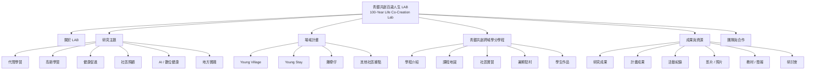
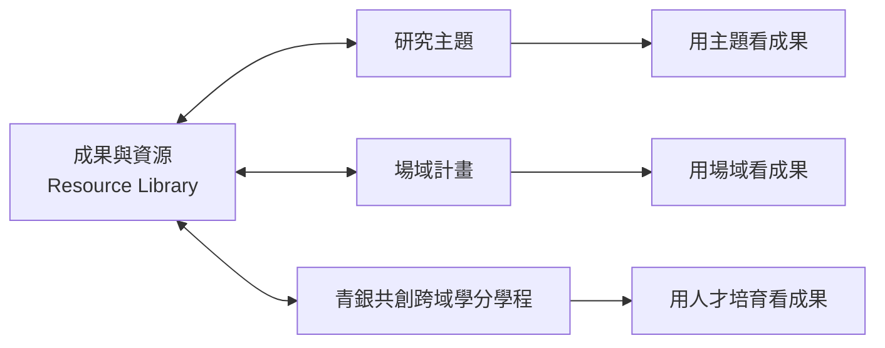

# 青銀共創百歲人生 LAB Portal 內容架構設計

日期：2026-06-10
狀態：v0.2，Bobo 已確認初步設計 OK
專案：`qingyin-100-life-site`

## 0. 設計確認紀錄

2026-06-10，Bobo 確認目前本機預覽中的 LAB Portal 初步設計方向 OK，可作為後續內容補齊與視覺微調的基準。

本次確認包含：

- LAB Portal 作為網站上層定位。
- 「青銀共創百歲人生 LAB」作為中文正式名稱。
- GitHub Pages + Astro 作為 Phase 1 平台。
- 研究主題、場域計畫、青銀共創跨域學分學程、成果與資源、團隊與合作作為主要資訊架構。
- 成果資源使用標籤串聯各計畫與研究主題。

後續調整不應推翻此架構，除非 Bobo 重新拍板。

## 1. 定位決策

本網站第一身份定為：

**青銀共創百歲人生 LAB**

它不是單一 USR 計畫頁，也不是純研究成果資料庫，而是 LAB 對外入口。網站應同時承載：

- LAB 的研究主題與方法
- 場域計畫與社區據點
- 青銀共創跨域學分學程與其課程、實習、駐村
- 研究、教學、計畫與活動成果
- 團隊、合作夥伴與聯絡資訊

英文名稱尚未定案，暫用工作名：

**100-Year Life Co-Creation Lab**

概念副標可暫用：

**Intergenerational Learning, Caring Communities, and Healthy Aging**

## 2. 平台決策

Phase 1 維持 **Astro + GitHub Pages**。

理由：

- 目前網站是靜態 LAB Portal，不需要會員、後台、多角色投稿、留言或交易功能。
- 研究成果、活動紀錄與教材可以用 Markdown / JSON / TypeScript data 管理。
- GitHub Pages 足夠支援公開 LAB 網站；影片放 YouTube，GitHub 只放頁面、壓縮圖片與資料索引。
- 標籤化內容資料庫可以在 Astro 內建立，不必為了 tag / relation 付費導入 WordPress。

暫不使用 WordPress。未來若出現以下需求，再評估：

- 老師或助理需要登入後台直接新增內容
- 多人高頻率上傳新聞、照片、活動紀錄
- 需要權限管理、表單資料庫、會員、留言、複雜媒體庫
- 需要大量 SEO / 行銷 / 自動化外掛

## 3. 網站主架構



## 4. 頁面職責

| 頁面 | 角色 | 主要內容 |
|---|---|---|
| 首頁 | LAB 入口 | LAB 是誰、研究方向、場域計畫、學程、成果與最新影像 |
| 關於 LAB | 身份說明 | LAB 理念、主持人、命名脈絡、研究與行動定位 |
| 研究主題 | 學術門面 | 代間學習、高齡學習、健康促進、社區照顧、AI / 數位健康、地方實踐 |
| 場域計畫 | 行動現場 | Young Village、Young Stay、籐寮仔、平地農村、新住民合作、廢棄小學活化 |
| 青銀共創跨域學分學程 | 人才培育路徑 | 學程介紹、課程地圖、健康老化與健康促進、社區實習、暑期駐村、學生作品 |
| 成果與資源 | 可標籤化資料庫 | 研究成果、計畫成果、活動紀錄、影片、照片、新聞、教材、簡報、研討會 |
| 團隊與合作 | 對外連結 | 老師、研究生、助理、學生團隊、社區夥伴、合作單位、聯絡方式 |

## 5. 首頁區塊順序

1. **Hero**
   - H1：青銀共創百歲人生 LAB
   - 英文工作名：100-Year Life Co-Creation Lab
   - 副標：Intergenerational Learning, Caring Communities, and Healthy Aging
   - 一句話說明：以代間共創、高齡學習、健康促進與社區照顧為核心，連結大學課程、地方場域與行動研究，探索百歲人生中的學習、照顧與共生可能。

2. **LAB 做什麼**
   - 研究
   - 場域
   - 學程
   - 成果

3. **研究主題**
   - 以六個主題卡呈現：代間學習、高齡學習、健康促進、社區照顧、AI / 數位健康、地方實踐。

4. **場域計畫**
   - Young Village
   - Young Stay
   - 籐寮仔
   - 其他社區據點

5. **青銀共創跨域學分學程**
   - 學程是上層容器；課程、實習、暑期駐村與學生作品都放在學程底下。

6. **近期成果與資源**
   - 從標籤化成果資料庫自動挑選近期或精選項目。

7. **團隊與合作邀請**
   - 導向團隊、合作與聯絡方式。

## 6. 標籤化內容模型

成果與資源不是孤立頁面，而是所有研究主題、場域計畫與學程的共用資料庫。每一筆成果應能連回：

- 對應研究主題
- 對應場域計畫
- 對應學程 / 課程 / 實習
- 年份
- 類型
- 素材狀態
- 對外可公開程度

### 6.1 成果資料範例

```yaml
title: 籐寮仔祈福燈會暨社規師成果展
year: 2026
date: 2026-02-13
type: activity_record
visibility: public
tags:
  - Young Stay
  - 籐寮仔
  - 場域計畫
  - 代間學習
  - 文化傳承
  - 影片
related_projects:
  - young-stay
  - tengliaozai
related_research:
  - intergenerational-learning
  - community-care
related_program:
  - qingyin-credit-program
assets:
  video_playlist: PLuLkwCRh9ebxXboy4qsWnmTrvBBPVvoco
  photos: pending-consent
summary: 社區成果展與祈福燈會，呈現跨世代共同參與的場域實踐。
```

### 6.2 串聯邏輯



同一筆成果只維護一次，但可以出現在多個脈絡頁。

例如：

| 成果 | 可出現位置 |
|---|---|
| 籐寮仔祈福燈會影片 | 成果與資源、Young Stay、籐寮仔、代間學習 |
| 健康促進課程教材 | 成果與資源、青銀共創跨域學分學程、健康促進 |
| 學生暑期社區實習作品 | 成果與資源、學程、Young Village / Young Stay |
| 代間學習研討會 | 成果與資源、代間學習、學術活動 |
| USR 活動紀錄 | 成果與資源、場域計畫、地方實踐 |

## 7. 現有內容歸位

| 現有內容 | 新位置 |
|---|---|
| 籐寮仔、食農體驗營、籐惜共好協會 | 場域計畫 |
| YouTube 播放清單、照片牆、活動紀錄 | 成果與資源 |
| 健康老化與健康促進、AI 模組課程 | 青銀共創跨域學分學程；同時標籤到研究主題：健康促進、AI / 數位健康 |
| 代間學習研討會 | 成果與資源；同時標籤到研究主題：代間學習 |
| 老師、研究生、助理、合作單位 | 團隊與合作 |
| 原本青銀共創百歲人生 USR 內容 | 保留為 LAB 旗下旗艦計畫之一，不再作為整站唯一主角 |

## 8. 導覽建議

目前導覽：

- 關於我們
- 計畫與實踐
- 影像紀錄
- 成果與報導
- 團隊成員
- 聯絡合作

建議改為：

- 關於 LAB
- 研究主題
- 場域計畫
- 學分學程
- 成果資源
- 團隊合作

英文暫譯：

- About
- Research
- Field Projects
- Credit Program
- Resources
- Team & Partners

## 9. 內容維護原則

1. **不編造**
   - 任何數字、年份、職稱、合作單位、成果名稱都必須能對應到內容來源。

2. **先資料，後頁面**
   - 研究主題、場域計畫、學程、成果資源都應逐步資料化，避免硬寫死在單一頁面。

3. **成果只維護一次**
   - 透過 tags / relations 出現在多個頁面，不重複複製文字。

4. **素材授權先行**
   - 可辨識人臉照片、兒童與長者影像，上線前要確認同意。

5. **影片外部嵌入**
   - 影片放 YouTube、學校影音平台或雲端；GitHub 不存大型影片。

6. **WordPress 先不導入**
   - 只有當非技術維護需求明確壓過 GitHub / Markdown 維護成本時，再評估 WordPress 或 headless CMS。

## 10. 待確認事項

- 英文正式名稱是否使用 `100-Year Life Co-Creation Lab`，或另定名稱。
- Young Village 的正式中文、英文名稱與場域資料。
- Young Stay 的正式中文、英文名稱與是否等同籐寮仔 / 廢棄小學基地。
- 健康促進研究要列為單一主題，或拆成健康促進、數位健康、AI 健康學習。
- 學程頁是否需要放招生資訊、修課規則、學分認列與課程地圖。
- 團隊頁公開程度：是否列研究生、助理、歷屆學生、社區夥伴姓名與照片。
- 成果資料的公開等級：public / internal / pending-consent。

## 11. 下一步

Phase 1 建議先做資訊架構改版，不碰大型功能：

1. 更新 `CONTENT_SOURCE_OF_TRUTH.md`，加入 LAB Portal 定位與標籤模型。
2. 調整 `src/data/site.ts` 的站名、導覽、首頁文案。
3. 新增或改名頁面：
   - `research`
   - `field-projects`
   - `program`
   - `resources`
4. 把既有 `projects / media / outcomes` 內容整理到新架構。
5. 建立第一版資料結構：
   - `src/data/research.ts`
   - `src/data/fieldProjects.ts`
   - `src/data/resources.ts`
   - `src/data/program.ts`
6. 本機 build 驗證。
7. 視覺檢查桌機與手機版。

commit / push 需另行取得 Bobo 明確拍板。
